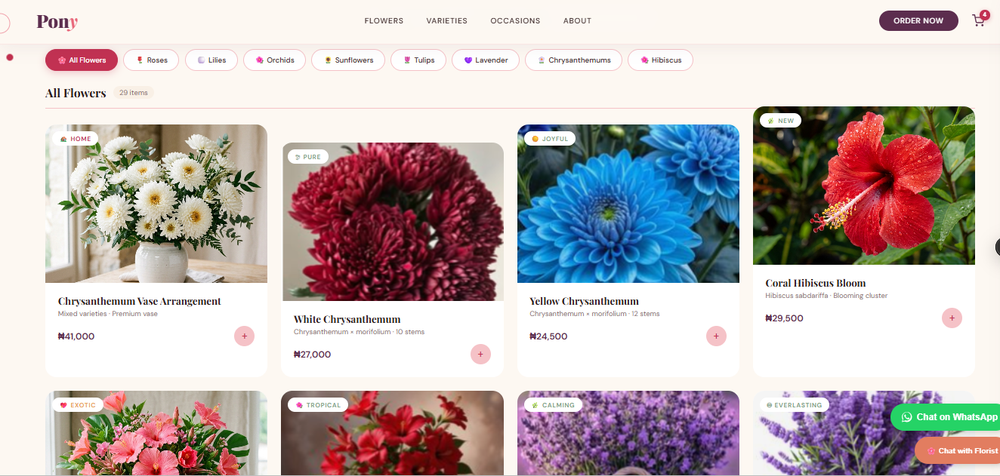
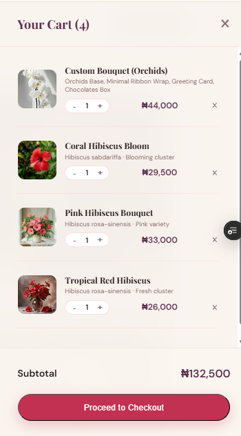
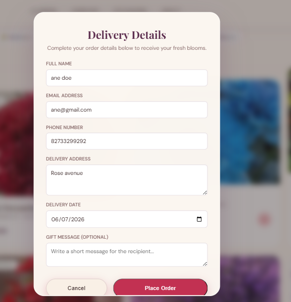
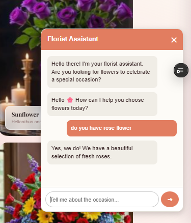
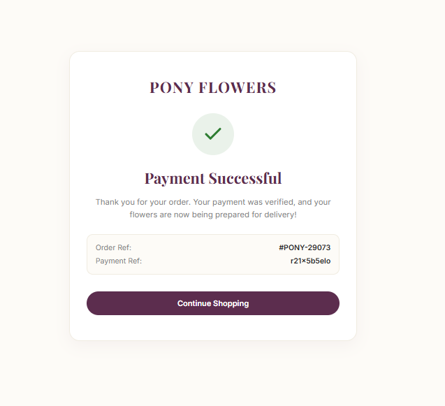
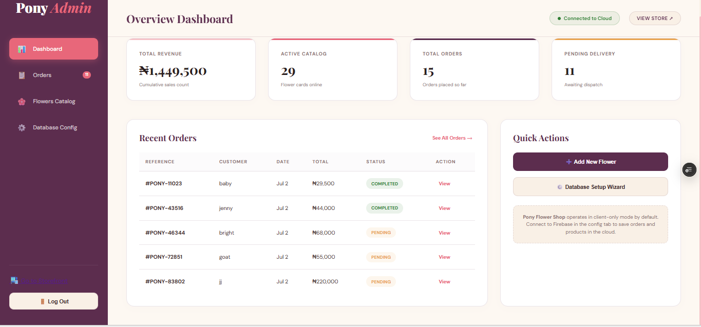

# 🌸 Pony Flower Website v1.0

A modern, AI-powered flower e-commerce website built to deliver a seamless online flower shopping experience. Customers can browse beautiful floral arrangements, receive AI-powered flower recommendations, securely complete payments through Paystack, and track their orders through a professional checkout experience.

This project was built as a full-stack portfolio project to demonstrate frontend development, backend integration, AI integration, secure payment processing, database management, and deployment.

---

# 🌐 Live Demo

**Live Website**

https://pony-website-eight.vercel.app

---

# 📸 Screenshots.

## Homepage


---

## Featured Flowers



---

## Shopping Cart



---

## Checkout




---

## AI Florist Assistant



---

## Payment Success



---

## Admin Dashboard



---

# ✨ Features

## Customer Features

* Browse beautiful flower collections
* Responsive design for desktop, tablet, and mobile
* Shopping cart
* Secure checkout
* Delivery details form
* AI Florist Assistant powered by Google Gemini
* WhatsApp ordering support
* Secure Paystack payment integration
* Payment verification
* Payment success page
* Mobile-friendly user interface

---

## Admin Features

* View customer orders
* View purchased flowers
* Customer information
* Delivery details
* Payment status
* Payment reference tracking
* Order status management
* Firestore integration

---

# 🤖 AI Integration

The website includes an AI-powered florist assistant capable of helping customers with questions such as:

* Which flowers are best for birthdays?
* Which flowers symbolize love?
* What bouquet should I buy for an anniversary?
* Flower care tips
* Personalized flower recommendations

The AI assistant is powered securely using the Google Gemini API through a protected backend endpoint.

---

# 💳 Payment System

Secure online payments are powered by Paystack.

Features include:

* Server-side payment initialization
* Secure Paystack verification
* Payment success handling
* Failed payment handling
* Cancelled payment handling
* Payment reference storage
* Paid orders only
* Protected secret keys using Vercel Environment Variables

---

# 🔒 Security

Security was an important focus throughout development.

Implemented security features include:

* HTTPS
* Secure server-side API endpoints
* Environment variables for secret keys
* Protected Paystack Secret Key
* Server-side payment verification
* Secure AI API integration
* Vercel Serverless Functions
* Security Headers Grade: **A** on SecurityHeaders.com

---

# 🛠 Technologies Used

### Frontend

* HTML5
* CSS3
* JavaScript (Vanilla)

### Backend

* Vercel Serverless Functions

### Database

* Firebase
* Cloud Firestore

### Cloud Storage

* Cloudinary

### Artificial Intelligence

* Google Gemini API

### Payments

* Paystack

### Deployment

* GitHub
* Vercel

---

# 📂 Project Structure

```text
├── index.html
├── admin.html
├── payment-success/
├── api/
│   ├── chat.js
│   ├── paystack-init.js
│   └── paystack-verify.js
├── assets/
├── screenshots/
├── vercel.json
└── README.md

---

# 📈 Future Improvements

Future versions may include:

* Customer accounts
* Wishlist
* Email notifications
* Order tracking page
* Discount coupons
* Inventory management
* Multi-vendor support
* Analytics dashboard

---

# 🎯 Learning Objectives

This project helped strengthen my understanding of:

* Responsive Web Design
* REST APIs
* Firebase & Firestore
* Serverless Functions
* Payment Gateway Integration
* AI Integration
* Secure API Design
* Environment Variables
* Git & GitHub
* Vercel Deployment
* Web Security Best Practices

---

# 🙏 Acknowledgements

Special thanks to:

* Google Gemini
* Firebase
* Paystack
* Cloudinary
* Vercel
* GitHub

for providing the technologies that made this project possible.

---

# 📜 License

This project was created for educational and portfolio purposes.

---

## 👨‍💻 Author

Built with ❤️ by Samuel Mercy Oluwatobi

If you enjoyed this project, feel free to ⭐ the repository.
